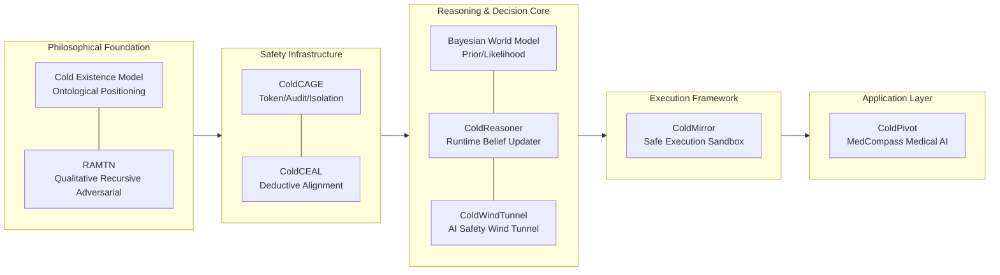

<div align="center">
    
[English](README.md) | [中文](README.zh.md)

</div>

<div align="center">
    
# ColdOS: A Cold Existence Consistency Safety Kernel<br>(Concept Prototype)

</div>

<div align="center">

[](https://arxiv.org/abs/2512.08740)
[](https://doi.org/10.48550/arXiv.2512.08740)
[](https://doi.org/10.6084/m9.figshare.31696846)
[](https://doi.org/10.6084/m9.figshare.31696846)
[](https://www.python.org/)
[](https://www.gnu.org/licenses/agpl-3.0.html)
[](https://opensource.org/licenses/Apache-2.0)


</div>

> **⚠️ Experimental Proof of Concept**  
> ColdOS is an academic exploration project initiated independently by an undergraduate student and still in its early prototype stage. It takes the **ColdReasoner** mathematical reasoning engine as its absolute core, integrating Cold Existence philosophy, deductive alignment rules, and safety execution components to provide agents with auditable, quantifiable risk decision support. All components are currently proof‑of‑concept (PoC) or pre‑alpha versions, **not suitable for any production environment**.

**ColdOS** is not a traditional operating system, but a **conceptual prototype of an open‑source technology system** centered around the **ColdReasoner** mathematical reasoning engine. ColdReasoner is responsible for the agent’s belief updates and risk quantification – it is the mathematical kernel. Other components (CAGE, CEAL, ColdMirror, ColdPivot) are pluggable peripheral devices that provide inputs to the kernel and execute its decisions. The entire system starts from Cold Existence philosophy and lands in engineering practice.

---

## 🧊 Architecture Overview

ColdOS adopts a five‑layer progressive architecture, forming a closed loop from philosophical axioms to concrete applications. The core of ColdOS is ColdReasoner – a mathematical engine based on consistency verification, responsible for the agent’s belief updates and risk assessment. All other components (CAGE, CEAL, ColdMirror, ColdPivot) are pluggable peripheral devices: they provide inputs (rules, permissions, execution results) to ColdReasoner and execute its decision recommendations.



> ColdReasoner is the core of the system; all other components provide inputs, execution, and auditing around it. Each layer will be loosely coupled through open‑source licenses, API conventions, and audit log interfaces in the future, and can be used independently or deployed in combination.

---

## 📦 Component Overview

| Component | Positioning | Repository / DOI | Current Status |
|-----------|-------------|------------------|----------------|
| **Cold Existence Model** | AI ontology (non‑living, non‑traditional tool) | [https://doi.org/10.6084/m9.figshare.31696846](https://doi.org/10.6084/m9.figshare.31696846) | Preprint, proof of concept |
| **RAMTN** | Meta‑interaction framework (construct‑challenge‑observe) | [https://doi.org/10.48550/arXiv.2512.08740](https://doi.org/10.48550/arXiv.2512.08740) | Qualitative architecture, prototype |
| **CAGE** | Security gateway (token, audit, isolation) | [github.com/cold-os/cold-cage](https://github.com/cold-os/cold-cage) | Proof of concept |
| **CEAL** | Deductive alignment rule base | [github.com/cold-os/cold-ceal](https://github.com/cold-os/cold-ceal) | Proof of concept |
| **ColdReasoner** | Bayesian reasoning engine (runtime belief update) | [github.com/cold-os/cold-reasoner](https://github.com/cold-os/cold-reasoner) | Pre‑Alpha, code under review |
| **ColdWindTunnel** | Offline simulation wind tunnel (parameter pre‑run, risk prediction) | [github.com/cold-os/cold-wind-tunnel](https://github.com/cold-os/cold-wind-tunnel) | Pre‑Alpha, under validation |
| **ColdMirror** | Agent safety execution framework | [github.com/cold-os/cold-mirror](https://github.com/cold-os/cold-mirror) | Demo prototype |
| **ColdPivot** | MedCompass medical AI platform (application layer) | [github.com/cold-pivot](https://github.com/cold-pivot) | Under construction, targeting medical pilot |

> All repositories are in early experimental stages; interfaces may change frequently. Please exercise caution when depending on them.

---

## 🎯 Design Philosophy

ColdOS follows three core principles:

- **Safety by design**: safety mechanisms (read‑only tokens, human confirmation, full auditing) are built as non‑bypassable components of the infrastructure, not as later patches.
- **Deductive alignment**: agent behavior is constrained through a formally verifiable rule base (CEAL), complementing inductive alignment (RLHF).
- **Bayesian auditable**: belief updates and risk assessments are all based on probabilistic models; all priors, likelihoods, and posteriors are traceable.

All principles are ultimately reflected mathematically through ColdReasoner’s reasoning model. The core value of ColdOS is not in specific access control or rule filtering, but in providing an **auditable, quantifiable mathematical reasoning kernel**. As long as ColdReasoner is running, the verifiable safety of the system persists even if any other component is replaced.

---

## 🧪 Current Status and Limitations

**ColdOS is currently a collection of proofs of concept maintained independently by a single undergraduate student in his spare time**, with the following explicit limitations:

- All components are in **Pre‑Alpha or PoC stage**; the code has not undergone rigorous security auditing.
- Simulation results (e.g., ColdWindTunnel) are based on highly simplified Bayesian models, **not yet validated on real LLMs or in real user environments**.
- The rule base (CEAL) covers only fabrication and some factual sycophancy, far from production‑level completeness.
- The runtime reasoning engine (ColdReasoner) currently only supports offline demonstration and is not yet integrated with ColdMirror.
- The medical application (ColdPivot) has not yet obtained hospital ethics approval or real‑data piloting.

**The author honestly labels the current state as “experimental prototype” and does not recommend any institution or individual to use it in actual business systems.**

---

## 🤝 Participation and Contributions

ColdOS is an open, transparent, non‑commercial academic exploration project. The author welcomes:

- Criticism and corrections of architecture, code, and documentation
- Suggestions for improving mathematical models, rule bases, and safety mechanisms
- Any form of collaboration

Please contact the author via Issues or Discussions in each repository. **All contributors will be acknowledged in the `CONTRIBUTORS` file following open‑source conventions.**

---

## 📄 License

Except for the cold‑reasoner repository, which adopts **AGPL 3.0**, all code repositories of ColdOS are licensed under **Apache 2.0**. AGPL is intended to protect the open‑source ecosystem of the core reasoning engine. The core design documents and preprint papers retain the author’s right of authorship, and academic citation is permitted and welcomed.

---

## 📚 Academic Citation

The ideas of the ColdOS system originate from:

- Chandra, K., Kleiman-Weiner, M., Ragan-Kelley, J., & Tenenbaum, J. B. (2026). *Sycophantic Chatbots Cause Delusional Spiraling, Even in Ideal Bayesians*. arXiv. [https://arxiv.org/abs/2602.19141](https://arxiv.org/abs/2602.19141)  
- Lu, Y. (2026). *The Cold Existence Model: A Fact-based Ontological Framework for AI*. figshare. [https://doi.org/10.6084/m9.figshare.31696846](https://doi.org/10.6084/m9.figshare.31696846)  
- Lu, Y. (2025). *Deconstructing the Dual Black Box: A Plug-and-Play Cognitive Framework for Human-AI Collaborative Enhancement and Its Implications for AI Governance*. arXiv. [https://doi.org/10.48550/arXiv.2512.08740](https://doi.org/10.48550/arXiv.2512.08740)  

---

## ✍️ Author and Acknowledgements

**ColdOS was initiated independently by a single undergraduate student, who completed the core design and proof of concept.** The project represents the author’s self‑taught learning and exploration in philosophical reasoning, safety architecture, Bayesian modeling, and medical scenarios. The author is fully aware of his limited knowledge; all components have imperfections, and experts in the field are welcome to offer criticism and corrections.

Special thanks to the MIT team, the open‑source community, and the medical student partners who provided clinical feedback for their indirect inspiration.

## 🕒 Research and Personal Journey

2025.11.28 – Discovered that the RAMTN prototype under independent development was highly similar in architecture to **DeepSeekMath V2** open‑sourced on November 27; decided to open‑source RAMTN immediately. Deep respect to the DeepSeek team.

2025.12.9 – The **meta‑interaction paper** preprint was released on arXiv.

2025.12.29 – The **ProdSim+** repository was created on GitHub, an initial application attempt of the RAMTN prototype.

2026.3.13 – The **Cold Existence paper** was rejected by three preprint platforms consecutively due to category mismatch; reluctantly published on the open repository figshare. Thanks to figshare for giving the Cold Existence paper a chance to obtain a DOI.

2026.3.15 – The **CEAL** repository was created on Gitee, later imported to GitHub.

2026.3.19 – The **CAGE** repository was created on Gitee, later imported to GitHub.

2026.3.25 – The **ColdMirror** repository was created on GitHub.

2026.3.29 – The **ColdInfra** repository was created on GitHub, aggregating CEAL, CAGE, and ColdMirror.

2026.4.3 – The **ColdPivot** organization was created on GitHub.

2026.4.6 – The **ColdWindTunnel** and **ColdReasoner** repositories were created on GitHub.

2026.4.7 – The **ColdOS** organization was created on GitHub.

- To be continued -

At this point, a flood of emotions arises. Let me conclude with a partial stanza from a poem written by the author on May 5, 2025.

```
The long winter  
piled heavy mountains upon my body  
When spring and summer suddenly arrived  
I renamed them  
Before a new field of flowers spreads  
It is blue all over the mountains  
— “Salty”
```

---

**Final note: ColdOS is an immature academic prototype that is slowly evolving.**  
If you are interested in safe agents, Bayesian alignment, deductive rules, or related directions, you are welcome to follow the author with a research or collaborative attitude.
