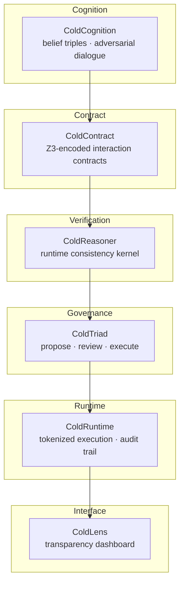

[English](README.md) | [中文](README.zh.md)

# Cold Trust Protocol Stack

### Trust Protocols for Human–AI Interaction — a Computational Social Science Research Portfolio

> **⚠️ Experimental Research Prototypes**
> The Cold Trust Protocol Stack (CTPS) is an open-source research portfolio, initiated and maintained independently by an undergraduate computer science student, positioned at the intersection of **computational social science (CSS)** and **human–computer interaction (HCI)**. It explores one question: **how can humans and AI agents interact under auditable, verifiable terms of trust?** All six artifacts are early prototypes (proof-of-concept / pre-alpha), honestly labeled, and **not suitable for any production environment**.

---

## 🧊 What Is This?

**One question, six artifacts.**

CTPS treats human–AI interaction as a *protocol problem*: what an agent may claim, what it may do, how claims are checked against actions, how authority is granted and audited, and how all of this is made visible to the human on the other side of the screen.

Instead of trusting the model's internal state, CTPS asks: **what agreements can we write down, verify, and show to a human?** Each layer of the stack answers one sub-question of that larger question — and each sub-question is implemented as an independent, runnable, open-source prototype.

For **computational social science**, this portfolio plays a dual role. It is a *research object*: an instrumented, auditable interaction protocol whose effects on human trust, reliance, and delegation can be studied computationally. And it is a *technical example*: how a "trustworthy-by-architecture" protocol can be designed, verified, and rendered visible. Every layer produces structured traces — belief reports, verification decisions, tokens, audit logs — which are, in themselves, data for the computational study of human–AI trust. For **HCI**, it contributes a transparency interface and a research question about trust calibration; for **AI governance**, it demonstrates auditability, alignment, and authorization by design.

```mermaid
flowchart TD
    subgraph L1[Cognition]
        A[ColdCognition<br/>belief triples · adversarial dialogue]
    end
    subgraph L2[Contract]
        B[ColdContract<br/>Z3-encoded interaction contracts]
    end
    subgraph L3[Verification]
        C[ColdReasoner<br/>runtime consistency kernel]
    end
    subgraph L4[Governance]
        D[ColdTriad<br/>propose · review · execute]
    end
    subgraph L5[Runtime]
        E[ColdRuntime<br/>tokenized execution · audit trail]
    end
    subgraph L6[Interface]
        F[ColdLens<br/>transparency dashboard]
    end
    A --> B --> C --> D --> E --> F
```

## 🎯 Why a Protocol Stack?

Mainstream AI-safety work tries to make the model trustworthy. CTPS takes the complementary position that emerged from the *dual black box* problem: **human expert intuition and AI decision-making are both opaque**, so the reliable surface between them is not a better model — it is a better *interaction protocol*.

Three commitments drive the stack:

- **Trust by architecture.** Trustworthiness is treated as a structural property, not a model property: unsafe actions should be *structurally impossible*, not merely discouraged. (See L4, L5.)
- **Auditability as a first-class feature.** Every decision is a replayable trace: who asked, what was claimed, what was checked, what was executed. (See L3, L5.)
- **Cognition-aware interaction.** Protocols must respect how humans actually form beliefs and calibrate trust — certainty is expressed in triples (certain / speculative / unknown), not in silent confidence. (See L1.)

From a CSS perspective, these commitments make trust *measurable*: rejection rates, belief-deviation distributions, token/audit coverage, and dashboard-interaction traces are computable quantities that link protocol design to human behavior — the empirical core of the portfolio's next phase.

## 📦 The Six Layers

| Layer | Artifact | Core Research Question | Current Status |
|-------|----------|------------------------|----------------|
| **L1 · Cognition** | [ColdCognition](https://github.com/cold-os/ColdCognition) | How should an agent *express* what it believes vs. what it merely speculates? | Pre-alpha prototype |
| **L2 · Contract** | [ColdContract](https://github.com/cold-os/ColdContract) | How can the terms of interaction be made formally checkable? | Pre-alpha prototype |
| **L3 · Verification** | [ColdReasoner](https://github.com/cold-os/ColdReasoner) | How can an agent's words be checked against its actions at runtime? | Pre-alpha, flagship |
| **L4 · Governance** | [ColdTriad](https://github.com/cold-os/ColdTriad) | How can unsafe actions be made *structurally* impossible? | Pre-alpha prototype |
| **L5 · Runtime** | [ColdRuntime](https://github.com/cold-os/ColdRuntime) | What does a full protocol-aware agent runtime look like? | Pre-alpha prototype |
| **L6 · Interface** | [ColdLens](https://github.com/cold-os/ColdLens) | How do humans perceive and trust an agent operating under protocol? | Pre-alpha prototype |

## 🧪 Status & Limitations

**Honest state:** every artifact is a pre-alpha or proof-of-concept prototype, written in Python, largely AI-assisted in implementation, with core ideas and architecture authored by a single undergraduate. Explicit limitations:

- **No empirical analysis yet.** The stack's central claims are about *human* trust and understanding — neither computational analysis of interaction traces (CSS) nor systematic user studies (HCI) has been conducted. L6 exists but has not been studied.
- No rigorous formal guarantees: L2/L3 encode decidable constraints but are not machine-checked proofs.
- Rule bases cover demo-level scenarios only; adversarial testing is incomplete.
- Isolation and token mechanisms are simulated, not production-grade.

**The author does not recommend any institution or individual use these artifacts in production, safety-critical, or real-world decision-making contexts.**

## 🗺️ For Reviewers: How to Read This Portfolio

- **If you come from computational social science**: treat the stack as a *research object* — an instrumented interaction protocol whose traces (belief reports, verification verdicts, audit logs, dashboard interactions) are data for studying human–AI trust, reliance, and delegation at scale.
- **If you come from HCI**: start with [ColdLens](https://github.com/cold-os/ColdLens) — the transparency interface — and its research question about trust calibration; [ColdReasoner](https://github.com/cold-os/ColdReasoner) is the consistency kernel behind it.
- **If you come from AI governance**: see how the stack operationalizes visibility, alignment, and authorization by design (L4–L6), and the two papers below for the theoretical framing.
- All repos run in minutes: `pip install -r requirements.txt` + a model API key (see each README).

## 🛣️ Roadmap

1. **Computational empirical study (CSS)**: analyze human–AI trust on public interaction traces and dashboard logs — rejection rates, belief-deviation distributions, reliance patterns.
2. **User studies (HCI)**: trust calibration and mental-model studies on ColdLens.
3. **Adversarial evaluation** of ColdContract / ColdReasoner rule bases on real dialogue corpora.
4. **Integration** with mainstream agent frameworks (e.g., LangChain) as pluggable middleware.

## 📚 Papers

- Lu, Y. (2025). *Deconstructing the Dual Black Box: A Plug-and-Play Cognitive Framework for Human-AI Collaborative Enhancement and Its Implications for AI Governance.* arXiv:2512.08740. [https://doi.org/10.48550/arXiv.2512.08740](https://doi.org/10.48550/arXiv.2512.08740)
- Lu, Y. (2026). *The Cold Existence Model: A Fact-based Ontological Framework for AI.* figshare. [https://doi.org/10.6084/m9.figshare.31696846](https://doi.org/10.6084/m9.figshare.31696846)

## 🤝 Participation

An open, transparent, non-commercial academic exploration. The author welcomes critiques of architecture, code, and documentation; suggestions on verification rules and visualization; and interdisciplinary collaboration. Contact via Issues / Discussions in each repository. Contributors are acknowledged in the `CONTRIBUTORS` file.

## 📄 License

All code repositories are licensed under **Apache 2.0**. The core design documents and preprint papers retain the author's right of authorship; academic citation is permitted and welcomed.

## ✍️ Author

Initiated and maintained independently by an undergraduate computer science student working without a lab or advisor — as a sustained, self-directed research program. The author is fully aware of his limits; expert criticism is earnestly invited. Special thanks to the open-source community.

## 🕒 Research Timeline (selected)

- **2025.11** — Discovered that the independently-developed RAMTN prototype was highly similar in architecture to DeepSeekMath-V2 (open-sourced 2025.11.27); open-sourced RAMTN immediately.
- **2025.12** — *Meta-interaction* paper released on arXiv; ProdSim+ created as an initial RAMTN application.
- **2026.03** — *Cold Existence* paper rejected by three preprint platforms (category mismatch); published on figshare with a DOI.
- **2026.03–04** — CEAL, CAGE, ColdMirror, ColdReasoner, AtomTolopo, MetaSymbion and the ColdOS organization created — the stack takes shape.
- **2026.07** — BehaviOS: the integrated protocol-aware runtime.
- **2026.08** — The stack is re-organized and re-named as the **Cold Trust Protocol Stack**, positioned as a CSS-anchored HCI research portfolio.

*— To be continued —*

---

**The Cold Trust Protocol Stack is an early-stage research portfolio on trust protocols for human–AI interaction, anchored in computational social science and methodological home of HCI.** It is not ready for production, but the question it asks — *what must a human and an agent agree on, before the agent acts?* — deserves careful, interdisciplinary exploration. Researchers in CSS, HCI, and AI governance are warmly invited to build on, criticize, or collaborate with this work.
