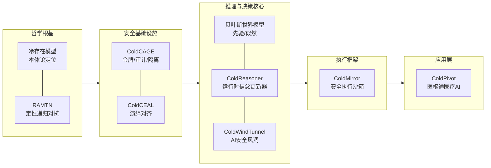

<div align="center">
    
[English](README.md) | [中文](README.zh.md)

</div>

<div align="center">
    
# ColdOS: 一个面向智能体的形式化操作系统（概念原型）

</div>

<div align="center">

[](https://arxiv.org/abs/2512.08740)
[](https://doi.org/10.48550/arXiv.2512.08740)
[](https://doi.org/10.6084/m9.figshare.31696846)
[](https://doi.org/10.6084/m9.figshare.31696846)
[](https://www.python.org/)
[](https://www.gnu.org/licenses/agpl-3.0.html)
[](https://opensource.org/licenses/Apache-2.0)


</div>

> **⚠️ 实验性概念验证**  
> ColdOS 是一个由本科生独立发起的、尚处于早期原型阶段的学术探索项目。它旨在以 **ColdReasoner** 数学推理引擎为绝对核心，融合冷存在哲学、演绎对齐规则与安全执行组件，为智能体提供可审计、可量化的风险决策支持。当前所有组件均为概念验证（PoC）或预阿尔法版本，**不适合用于任何生产环境**。

**ColdOS** 不是一个传统的操作系统，而是一个 **面向智能体的形式化操作系统** 的概念原型。它管理的不是硬件资源，而是智能体的**信念、行为与一致性**。其核心是 **ColdReasoner** 形式化验证引擎，通过三层一致性校验（信念合法性、行为自洽性、行为-信念一致性）对智能体行为施加可审计、可量化的约束。所有其他组件均为可插拔的外挂装置，为 ColdReasoner 提供输入并执行其决策。

---

## 🧊 架构总览

ColdOS 采用五层递进式架构，从哲学公理到具体应用形成闭环。ColdOS 的核心是 ColdReasoner——一个基于一致性校验的数学引擎，负责智能体的信念更新与风险评估。所有其他组件（CAGE、CEAL、ColdMirror、ColdPivot）均为可插拔的外挂装置，它们为 ColdReasoner 提供输入（规则、权限、执行结果）并执行其决策建议。



> ColdReasoner 是这个面向智能体的形式化操作系统的形式化内核。所有其他组件都是可插拔的外挂装置，为其形式化一致性校验提供输入。如果系统的语义——信念区间、行为合法性、映射函数——均被形式化定义，整个操作系统将成为一个 **可数学验证的智能体运行时环境**。

---

## 📦 组件一览

| 组件 | 定位 | 仓库 / DOI | 当前状态 |
|------|------|------|----------|
| **冷存在模型** | AI 本体论（非生命、非传统工具） | [https://doi.org/10.6084/m9.figshare.31696846](https://doi.org/10.6084/m9.figshare.31696846) | 预印本，概念验证 |
| **RAMTN** | 元交互框架（建构‑质疑‑观察） | [https://doi.org/10.48550/arXiv.2512.08740](https://doi.org/10.48550/arXiv.2512.08740) | 定性架构，原型 |
| **CAGE** | 安全网关（令牌、审计、隔离） | [github.com/cold-os/cold-cage](https://github.com/cold-os/cold-cage) | 概念验证 |
| **CEAL** | 演绎对齐规则库 | [github.com/cold-os/cold-ceal](https://github.com/cold-os/cold-ceal) | 概念验证 |
| **ColdReasoner** | 贝叶斯推理引擎（运行时信念更新） | [github.com/cold-os/cold-reasoner](https://github.com/cold-os/cold-reasoner) | Pre‑Alpha，代码审查中 |
| **ColdWindTunnel** | 离线模拟风洞（参数预演、风险预测） | [github.com/cold-os/cold-wind-tunnel](https://github.com/cold-os/cold-wind-tunnel) | Pre‑Alpha，验证中 |
| **ColdMirror** | 智能体安全执行框架 | [github.com/cold-os/cold-mirror](https://github.com/cold-os/cold-mirror) | 演示原型 |
| **ColdPivot** | 医枢通医疗 AI 平台（应用层） | [github.com/cold-pivot](https://github.com/cold-pivot) | 组建中，面向医疗试点 |

> 所有仓库均处于早期实验阶段，接口可能频繁变化，请谨慎依赖。

---

## 🎯 设计哲学

ColdOS 遵循三条核心原则：

- **安全原生**：安全机制（只读令牌、人工确认、全审计）作为底层不可绕过的构件，而非后期补丁。
- **演绎对齐**：通过可形式化验证的规则库（CEAL）约束智能体行为，与归纳对齐（RLHF）互补。
- **贝叶斯可审计**：信念更新、风险评估全部基于概率模型，所有先验、似然、后验均可追溯。

所有原则最终通过 ColdReasoner 的推理模型得到数学体现。ColdOS 的核心价值不在于具体的权限控制或规则过滤，而在于提供一个 **可审计、可量化的数学推理内核**。只要 ColdReasoner 在运行，即使替换掉其他任何组件，系统的安全可验证性依然存在。

这三条原则通过 **形式化操作系统抽象** 得以实现：智能体信念被类型化为区间，行为被类型化为带有形式化一致性规则的枚举，每一次决策都被记录为可回放、可对照形式规范验证的轨迹。这旨在使 ColdOS 有潜力成为一个 **完全可审计、可机器检查的智能体部署平台**。当前原型实现了核心的一致性校验，**完整的形式化验证尚待未来工作**。

---

## 🧪 当前状态与局限

**ColdOS 目前是一个由单名本科生在业余时间独立维护的概念验证集合**，存在以下明确局限：

- 所有组件均为 **Pre‑Alpha 或 PoC 阶段**，代码未经严格安全审计。
- 模拟结果（如 ColdWindTunnel）基于高度简化的贝叶斯模型，**尚未在真实 LLM 或真实用户环境中验证**。
- 规则库（CEAL）仅覆盖虚构和部分事实性谄媚，远未达到生产级完备性。
- 运行时推理引擎（ColdReasoner）目前仅支持离线演示，未与 ColdMirror 完成集成。
- 医疗应用（ColdPivot）尚未获得医院伦理审批或真实数据试点。

**研究者诚恳地将当前状态标注为“实验性原型”，不推荐任何机构或个人将其用于实际业务系统。**

---

## 🤝 参与与贡献

ColdOS 是一个开放、透明、非商业化的学术探索项目。研究者欢迎：

- 对架构、代码、文档的批评与修正
- 对数学模型、规则库、安全机制的改进建议
- 任何形式的合作

请通过各仓库的 Issue 或 Discussion 与研究者联系。**所有贡献者将按照开源惯例在 `CONTRIBUTORS` 文件中致谢。**

---

## 📄 许可证

除 cold-reasoner 仓库采用 **AGPL 3.0** 外，ColdOS 所有代码仓库均采用 **Apache 2.0** 许可证，AGPL 旨在保护核心推理引擎的开源生态。核心设计文档与论文预印本保留作者署名权，允许并欢迎学术引用。

---

## 📚 学术引用

ColdOS 体系的思想来源包括：

- Chandra, K., Kleiman-Weiner, M., Ragan-Kelley, J., & Tenenbaum, J. B. (2026). *Sycophantic Chatbots Cause Delusional Spiraling, Even in Ideal Bayesians*. arXiv. [https://arxiv.org/abs/2602.19141](https://arxiv.org/abs/2602.19141)  
- Lu, Y. (2026). *The Cold Existence Model: A Fact-based Ontological Framework for AI*. figshare. [https://doi.org/10.6084/m9.figshare.31696846](https://doi.org/10.6084/m9.figshare.31696846)  
- Lu, Y. (2025). *Deconstructing the Dual Black Box: A Plug-and-Play Cognitive Framework for Human-AI Collaborative Enhancement and Its Implications for AI Governance*. arXiv. [https://doi.org/10.48550/arXiv.2512.08740](https://doi.org/10.48550/arXiv.2512.08740)  


---

## ✍️ 作者与致谢

**ColdOS 由一名本科生独立发起并完成核心设计与概念验证**。项目在哲学思辨、安全架构、贝叶斯建模、医疗场景等方面均为作者自主学习与探索的成果。作者深知自身知识储备有限，所有组件均存在不完善之处，欢迎领域专家批评指正。

特别感谢给予间接启发的 MIT 团队、开源社区以及提供临床反馈的医学生伙伴。

## 🕒研究与心路历程

2025.11.28 发现正在独立开发中的 RAMTN 原型与11月27日开源的 **DeepSeekMath V2** 在架构上存在高度相似，遂决定立刻开源 RAMTN。在此也向 DeepSeek 团队致以崇高的敬意。

2025.12.9 **元交互论文** 预印本在 arXiv 发布。

2025.12.29 **ProdSim+** 仓库在 GitHub 创建，这是 RAMTN 原型的一个初步应用的尝试。

2026.3.13 **冷存在论文** 连续被三个预印本平台因分类不符拒稿，无奈在开放存储平台 figshare 发布预印本。在此也感谢 figshare 给冷存在论文一个取得 DOI 的机会。

2026.3.15 **CEAL** 仓库在 Gitee 创建，后续导入 GitHub。

2026.3.19 **CAGE** 仓库在 Gitee 创建，后续导入 GitHub。

2026.3.25 **ColdMirror** 仓库在 GitHub 创建。

2026.3.29 **ColdInfra** 仓库在 GitHub 创建，汇总了 CEAL、CAGE 和 ColdMirror 三个项目。

2026.4.3 **ColdPiovt** 组织在 GitHub 创建。

2026.4.6 **ColdWindTunnel** 仓库和 ColdReasoner 仓库在 GitHub 创建。

2026.4.7 **ColdOS** 组织在 GitHub 创建。

-未完待续-

行文至此，百感交集。且引研究者在2025年5月5日写下的一首诗歌的部分段落结尾。
```
漫长的冬季  
在我的身上砌起厚重的山  
当春夏忽然来临  
我给它们换了名字  
在新的花野铺陈以前  
是漫山遍野的蓝  
——《咸》
```

---

**最后重申：ColdOS 是一个面向智能体的形式化操作系统的早期概念原型。** 
它尚未准备好用于生产，但其形式化基础值得更长期的探索。如果您对智能体安全的形式化方法、可验证对齐、或逻辑与自主系统的交叉领域感兴趣，欢迎以研究或协作的态度关注研究者。
