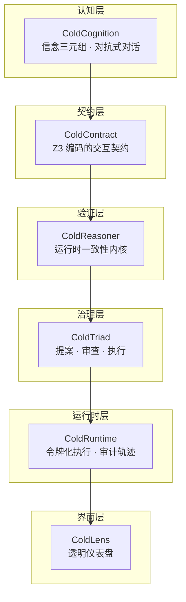

[English](README.md) | [中文](README.zh.md)

# Cold Trust Protocol Stack

### 面向人机交互的信任协议 —— 一个计算社会科学研究作品集

> **⚠️ 实验性研究原型**
> Cold Trust Protocol Stack（CTPS）是一个开源研究作品集，由一位计算机科学本科生独立发起并维护，定位于**计算社会科学（CSS）**与**人机交互（HCI）**的交汇处。它只探索一个问题：**人与 AI 智能体，如何在可审计、可验证的信任条款下互动？** 全部六件工件均为早期原型（概念验证 / pre-alpha），已如实标注，**不适用于任何生产环境**。

---

## 🧊 这是什么？

**一个问题，六件工件。**

CTPS 把人机交互视为一个*协议问题*：智能体可以宣称什么、可以做什么、宣称如何与行为核对、权限如何授予与审计，以及这一切如何呈现给屏幕另一端的人。

与其信任模型的内部状态，CTPS 追问的是：**我们能把哪些共识写下来、验证它、并展示给人看？** 栈的每一层都回答这个大问题的一个子问题——而每个子问题都以一个独立、可运行、开源的工件实现。

对**计算社会科学**而言，这个作品集扮演双重角色。它是*研究对象*：一套被仪器化、可审计的交互协议，其对人类信任、依赖与委托的影响可以用计算方法研究；它也是*技术示例*：展示"信任由架构保障"的协议如何被设计、验证并呈现于人前。每一层都产生结构化轨迹——信念报告、验证裁决、令牌、审计日志——它们本身就是研究人机信任的计算数据。对 **HCI** 而言，它贡献了一个透明界面和一个关于信任校准的研究问题；对 **AI 治理**而言，它示范了可见性、对齐与授权如何被设计进架构。

```mermaid
flowchart TD
    subgraph L1[认知层]
        A[ColdCognition<br/>信念三元组 · 对抗式对话]
    end
    subgraph L2[契约层]
        B[ColdContract<br/>Z3 编码的交互契约]
    end
    subgraph L3[验证层]
        C[ColdReasoner<br/>运行时一致性内核]
    end
    subgraph L4[治理层]
        D[ColdTriad<br/>提案 · 审查 · 执行]
    end
    subgraph L5[运行时层]
        E[ColdRuntime<br/>令牌化执行 · 审计轨迹]
    end
    subgraph L6[界面层]
        F[ColdLens<br/>透明仪表盘]
    end
    A --> B --> C --> D --> E --> F
```

## 🎯 为什么是协议栈？

主流 AI 安全工作试图让模型值得信任。CTPS 采取的是从*双重黑箱*问题中生长出来的互补立场：**人类专家的直觉与 AI 的决策都是不透明的**，因此两者之间真正可靠的界面，不是一个更好的模型——而是一个更好的*交互协议*。

三项承诺驱动整个栈：

- **架构即信任。** 可信赖性被视为结构性属性，而非模型属性：不安全的行为应当在结构上不可能发生，而不只是被劝阻。（参见 L4、L5）
- **可审计性是一等公民。** 每一个决策都是一条可回放的轨迹：谁请求的、宣称了什么、核对了什么、执行了什么。（参见 L3、L5）
- **认知感知的交互。** 协议必须尊重人类真实形成信念与校准信任的方式——确定性以三元组（确信 / 推测 / 未知）表达，而不是沉默的自信。（参见 L1）

从 CSS 的视角看，这些承诺让信任变得*可测量*：拒绝率、信念偏差分布、令牌与审计覆盖率、仪表盘交互轨迹——都是把协议设计与人类行为连接起来的可计算量，也是作品集下一阶段的实证核心。

## 📦 六层协议栈

| 层 | 工件 | 核心研究问题 | 当前状态 |
|-------|----------|------------------------|----------------|
| **L1 · 认知** | [ColdCognition](https://github.com/cold-os/ColdCognition) | 智能体如何*表达*它相信什么，而非只是推测什么？ | Pre-alpha 原型 |
| **L2 · 契约** | [ColdContract](https://github.com/cold-os/ColdContract) | 交互条款如何变得可形式化检验？ | Pre-alpha 原型 |
| **L3 · 验证** | [ColdReasoner](https://github.com/cold-os/ColdReasoner) | 智能体的言行如何在运行时核对？ | Pre-alpha，旗舰 |
| **L4 · 治理** | [ColdTriad](https://github.com/cold-os/ColdTriad) | 不安全的行为如何变得在*结构上*不可能？ | Pre-alpha 原型 |
| **L5 · 运行时** | [ColdRuntime](https://github.com/cold-os/ColdRuntime) | 一个完整的协议感知智能体运行时长什么样？ | Pre-alpha 原型 |
| **L6 · 界面** | [ColdLens](https://github.com/cold-os/ColdLens) | 人类如何感知并信任一个在协议下运行的智能体？ | Pre-alpha 原型 |

## 🧪 现状与局限

**诚实声明：** 每件工件都是 pre-alpha 或概念验证原型，以 Python 编写，实现中大量借助 AI 辅助，核心思想与架构由一位本科生独立完成。明确的局限：

- **尚无任何实证分析。** 这个栈的核心主张都关乎*人类*的信任与理解——既没有对交互轨迹的计算分析（CSS），也没有系统的用户研究（HCI）。L6 已经存在，但尚未被研究。
- 无严格的形式化保证：L2/L3 编码了可判定约束，但不是机器可检验的证明。
- 规则库仅覆盖演示级场景；对抗性测试尚不完整。
- 隔离与令牌机制是模拟的，未达生产级。

**作者不建议任何机构或个人将这些工件用于生产、安全关键或真实世界决策场景。**

## 🗺️ 给评审者：如何读这个作品集

- **如果您来自计算社会科学**：把协议栈当作*研究对象*——一套被仪器化的交互协议，其轨迹（信念报告、验证裁决、审计日志、仪表盘交互）是规模化研究人机信任、依赖与委托的数据。
- **如果您来自人机交互**：从 [ColdLens](https://github.com/cold-os/ColdLens)——透明界面——和它关于信任校准的研究问题开始；[ColdReasoner](https://github.com/cold-os/ColdReasoner) 是它背后的一致性内核。
- **如果您来自 AI 治理**：看协议栈如何把可见性、对齐与授权操作化进设计（L4–L6），理论框架见下方两篇论文。
- 所有仓库都能在几分钟内跑起来：`pip install -r requirements.txt` + 一个模型 API key（见各仓库 README）。

## 🛣️ 路线图

1. **计算实证研究（CSS）**：在公开交互轨迹与仪表盘日志上分析人机信任——拒绝率、信念偏差分布、依赖模式。
2. **用户研究（HCI）**：在 ColdLens 上开展信任校准与心智模型研究。
3. 在真实对话语料上对 ColdContract / ColdReasoner 规则库做对抗性评估。
4. 与主流智能体框架（如 LangChain）以可插拔中间件形式集成。

## 📚 论文

- Lu, Y. (2025). *Deconstructing the Dual Black Box: A Plug-and-Play Cognitive Framework for Human-AI Collaborative Enhancement and Its Implications for AI Governance.* arXiv:2512.08740. [https://doi.org/10.48550/arXiv.2512.08740](https://doi.org/10.48550/arXiv.2512.08740)
- Lu, Y. (2026). *The Cold Existence Model: A Fact-based Ontological Framework for AI.* figshare. [https://doi.org/10.6084/m9.figshare.31696846](https://doi.org/10.6084/m9.figshare.31696846)

## 🤝 参与

这是一个开放、透明、非商业的学术探索。作者欢迎对架构、代码与文档的批评；对验证规则与可视化的建议；以及跨学科合作。可通过各仓库的 Issues / Discussions 联系。贡献者将按开源惯例收录于 `CONTRIBUTORS` 文件。

## 📄 许可证

全部代码仓库以 **Apache 2.0** 许可。核心设计文档与预印本论文保留作者的署名权；欢迎并允许学术引用。

## ✍️ 作者

由一位没有实验室、没有导师的计算机科学本科生独立发起并维护——这是一项持续、自主的研究计划。作者深知自身局限，诚挚欢迎专家批评指正。特别感谢开源社区。

## 🕒 研究时间线（节选）

- **2025.11** —— 发现独立开发的 RAMTN 原型与 DeepSeekMath-V2（2025.11.27 开源）在架构上高度相似；当即开源 RAMTN。
- **2025.12** —— *元交互*论文发布于 arXiv；创建 ProdSim+ 作为 RAMTN 的首个应用尝试。
- **2026.03** —— *冷存在*论文因类别不符被三个预印本平台连续拒绝；改投 figshare 获得 DOI。
- **2026.03–04** —— 创建 CEAL、CAGE、ColdMirror、ColdReasoner、AtomTolopo、MetaSymbion 与 ColdOS 组织——协议栈成形。
- **2026.07** —— BehaviOS：集成的协议感知运行时。
- **2026.08** —— 协议栈重组并更名为 **Cold Trust Protocol Stack**，定位为以 CSS 为锚的 HCI 研究作品集。

*— 未完待续 —*

---

**Cold Trust Protocol Stack 是一个关于人机交互信任协议的早期研究作品集，以计算社会科学为锚，以人机交互为方法论家园。** 它尚未准备好投入生产，但它追问的那个问题——*在智能体行动之前，人与它究竟需要达成什么共识？*——值得认真而跨学科的探索。诚挚邀请 CSS、HCI 与 AI 治理的研究者在此基础上继续构建、批评或合作。
