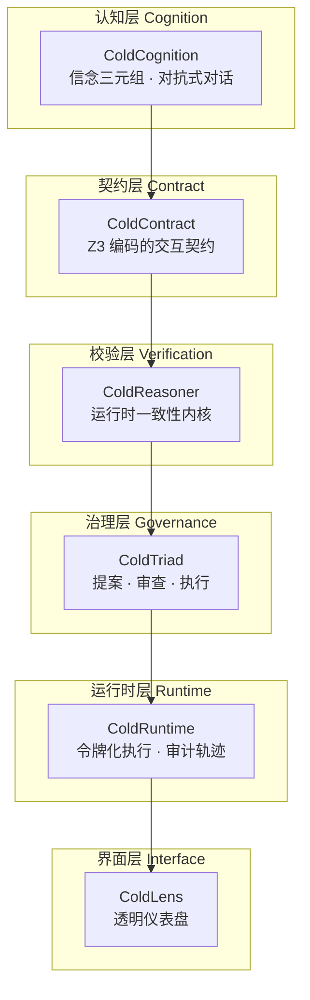

[English](README.md) | [中文](README.zh.md)

# Cold Trust Protocol Stack

### 人机交互的信任协议 —— 一个计算社会科学研究作品集

> **⚠️ 实验性研究原型**
> Cold Trust Protocol Stack 是一个由计算机科学本科生独立发起并维护的开源研究作品集。它只追问一个问题：**人类与 AI 智能体，能否在可审计、可验证的信任条款下互动？** 全部六个工件均为早期原型（概念验证 / pre-alpha），**不适用于任何生产环境**。

---

## 🧊 这是什么？

**一个问题，六个工件。**

Cold Trust Protocol Stack（CTPS）将人机交互视为一个"协议问题"：智能体可以宣称什么、可以做什么、宣称如何与行为相互校验、权限如何授予并被审计，以及这一切如何呈现在屏幕另一侧的人类眼前。

与其信任模型的内部状态，CTPS 追问的是：**我们能写下哪些约定，能验证它们，并把它们展示给人类？** 栈中的每一层回答这个大问题的一个子问题——每个子问题又被实现为一个独立、可运行、开源的工件。

这是一个处于**人机交互、认知科学与 AI 治理**交汇处的研究作品集：下面的工件存在的意义，是被人*看见、研究、批判*，而不是被部署。

```mermaid
flowchart TD
    subgraph L1[认知层 Cognition]
        A[ColdCognition\n信念三元组 · 对抗式对话]
    end
    subgraph L2[契约层 Contract]
        B[ColdContract\nZ3 编码的交互契约]
    end
    subgraph L3[校验层 Verification]
        C[ColdReasoner\n运行时一致性内核]
    end
    subgraph L4[治理层 Governance]
        D[ColdTriad\n提案 · 审查 · 执行]
    end
    subgraph L5[运行时层 Runtime]
        E[ColdRuntime\n令牌化执行 · 审计轨迹]
    end
    subgraph L6[界面层 Interface]
        F[ColdLens\n透明仪表盘]
    end
    A --> B --> C --> D --> E --> F
```

## 🎯 为什么是"协议栈"？

主流 AI 安全工作试图让模型值得信赖。CTPS 采取的，是从"双重黑箱"问题中生长出来的互补立场：**人类专家的直觉与 AI 的决策过程同样不透明**，因此两者之间真正可靠的界面，不是更好的模型，而是更好的*交互协议*。

三个承诺驱动着整个栈：

- **结构性信任（Trust by architecture）**。可信被当作一种结构属性，而非模型属性：不安全的行动应当是*结构上不可能*的，而不只是被劝阻。（见 L4、L5）
- **可审计性是一等公民**。每一个决策都是一条可重放的轨迹：谁请求的、宣称了什么、校验了什么、执行了什么。（见 L3、L5）
- **认知感知的交互**。协议必须尊重人类真实地形成信念、校准信任的方式——确定性以三元组（确信 / 推测 / 未知）表达，而不是沉默的自信。（见 L1）

## 📦 六个层次

| 层次 | 工件 | 核心研究问题 | 当前状态 |
|-------|----------|------------------------|----------------|
| **L1 · 认知** | [ColdCognition](https://github.com/cold-os/ColdCognition) | 智能体如何*表达*它"确信什么"与"仅仅推测什么"？ | Pre-alpha 原型 |
| **L2 · 契约** | [ColdContract](https://github.com/cold-os/ColdContract) | 交互的条款如何成为可被形式化检查的？ | Pre-alpha 原型 |
| **L3 · 校验** | [ColdReasoner](https://github.com/cold-os/ColdReasoner) | 运行时如何校验智能体的言行是否一致？ | Pre-alpha，旗舰 |
| **L4 · 治理** | [ColdTriad](https://github.com/cold-os/ColdTriad) | 如何让不安全的行为*结构上*不可能发生？ | Pre-alpha 原型 |
| **L5 · 运行时** | [ColdRuntime](https://github.com/cold-os/ColdRuntime) | 一个完整的协议感知智能体运行时是什么样？ | Pre-alpha 原型 |
| **L6 · 界面** | [ColdLens](https://github.com/cold-os/ColdLens) | 人类如何感知并信任一个在协议下运行的智能体？ | Pre-alpha 原型 |

### 各层简述

- **L1 · ColdCognition** —— RAMTN 递归对抗式对话（建构 · 质疑 · 观察），运行于三类信念（确信 / 推测 / 未知）之上，并以 Prolog 做一致性校验。*问题：结构化对话能否让智能体的认知状态变  可读？*
- **L2 · ColdContract** —— 基于 Z3 的"信念—令牌—行动"闭环的最小编码：什么可以被宣称、什么可以被执行、宣称会推出什么。*问题：交互条款能否变成可判定的约束？*
- **L3 · ColdReasoner** —— 一致性内核：信念合法性、行为自洽性、行为—信念一致性。*问题：运行时验证能否把信任从模型外包给协议？*
- **L4 · ColdTriad** —— 面向智能体的分权制衡：不能执行的提案者、不能行动的确定性审查者、只执行已批准操作的执行者——默认拒绝。*问题：能否让不安全的行为结构上不可能？*
- **L5 · ColdRuntime** —— 集成的 FastAPI 运行时：规划 → 预校验 → 一次性授权令牌 → 执行 → 六项后校验（含内容完整性）→ 防篡改的双重审计（SQLite + JSONL）。*问题：完整的协议感知运行时是什么样？*
- **L6 · ColdLens** —— 实时透明仪表盘：信念漂移趋势、雷达图、风险评分——把协议呈现于人前。*问题：看见协议，会改变人类对智能体的信任吗？（计划中的用户研究）*

## 🧪 现状与局限

**诚实的现状：** 每一个工件都是 pre-alpha 或概念验证原型，用 Python 编写，实现大量借助 AI 辅助，核心思想与架构由一名本科生独立完成。明确的局限：

- **尚无用户研究。** 这个栈的核心主张关乎*人类*的信任与理解——L6 已经存在，但尚未经过系统性研究。
- **无严格的形式化保证**：L2/L3 编码了可判定约束，但未经机器可检查的证明。
- 规则库仅覆盖演示级场景；对抗性测试尚不完整。
- 隔离与令牌机制为模拟实现，达不到生产级。
- 尚未在真实用户中验证。

**作者不建议任何机构或个人在生产、安全攸关或真实决策场景中使用这些工件。**

## 🗺️ 给评审者：如何读这个作品集

- **先看面向人的故事**：打开 [ColdLens](https://github.com/cold-os/ColdLens)，运行 Streamlit 演示——看看协议在人眼中是什么样子。
- **再看核心思想**：[ColdReasoner](https://github.com/cold-os/ColdReasoner)——把"信任"变成可检查属性的那个一致性内核。
- **然后看治理思想**：[ColdTriad](https://github.com/cold-os/ColdTriad)——分权制衡在智能体上的应用。
- **最后读理论**：下面两篇论文（RAMTN / 冷存在）说明了为什么可信的表面是协议，而不是模型。
- 所有仓库都可以在几分钟内跑起来：`pip install -r requirements.txt` + 一个模型 API key（见各仓库 README）。

## 🛣️ 路线图

1. **经验验证（HCI）**：ColdLens 上的用户研究——信任校准、依赖度、心智模型。
2. **对抗性评估**：在真实对话语料上评估 ColdContract / ColdReasoner 的规则库。
3. **集成**：以可插拔中间件的形式接入主流智能体框架（如 LangChain）。

## 📚 论文

- Lu, Y. (2025). *Deconstructing the Dual Black Box: A Plug-and-Play Cognitive Framework for Human-AI Collaborative Enhancement and Its Implications for AI Governance.* arXiv:2512.08740. [https://doi.org/10.48550/arXiv.2512.08740](https://doi.org/10.48550/arXiv.2512.08740)
- Lu, Y. (2026). *The Cold Existence Model: A Fact-based Ontological Framework for AI.* figshare. [https://doi.org/10.6084/m9.figshare.31696846](https://doi.org/10.6084/m9.figshare.31696846)

## 🤝 参与

这是一个开放、透明、非商业的学术探索项目。作者欢迎对架构、代码与文档的批评指正；对校验规则与可视化设计的建议；以及跨学科合作。请通过各仓库的 Issues / Discussions 联系作者。贡献者将按照开源惯例被记录在 `CONTRIBUTORS` 文件中。

## 📄 许可

所有代码仓库均采用 **Apache 2.0** 许可。核心设计文档与预印本论文保留作者署名权；欢迎学术引用。

## ✍️ 作者

由一位没有实验室、没有导师的计算机科学本科生独立发起并维护——作为一项持续的、自我驱动的研究计划。作者深知自身的局限，诚挚欢迎专家的批评。特别感谢开源社区。

## 🕒 研究时间线（节选）

- **2025.11** —— 发现独立开发的 RAMTN 原型与 DeepSeekMath-V2（2025.11.27 开源）架构高度相似；当即开源 RAMTN。
- **2025.12** —— *元交互*论文发布于 arXiv；创建 ProdSim+ 作为 RAMTN 的初步应用。
- **2026.03** —— *冷存在*论文连续被三个预印本平台拒绝（分类不符）；发布于 figshare 并获得 DOI。
- **2026.03–04** —— 创建 CEAL、CAGE、ColdMirror、ColdReasoner、AtomTolopo、MetaSymbion 与 ColdOS 组织——栈开始成形。
- **2026.07** —— BehaviOS：集成的协议感知运行时。
- **2026.08** —— 栈被重组并更名为 **Cold Trust Protocol Stack**，定位为 HCI / AI 治理研究作品集。

*—— 待续 ——*

---

**Cold Trust Protocol Stack 是一个关于人机交互信任协议的早期研究作品集。** 它还远未到生产可用，但它提出的问题——*在智能体行动之前，人与它究竟需要达成什么共识？*——值得谨慎而跨学科地探索。诚挚邀请 HCI、认知科学与 AI 治理领域的研究者在此基础上扩展、批评或协作。
